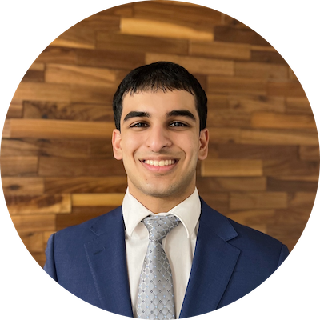

Hi! My name is Aditya, a student studying CS + Math at the University of Illinois Urbana-Champaign. I am a current sophomore (graduating in 2027) and am open to 2025/2026 internship roles within machine learning engineering, software dev, and quant dev. I am especially interested in AI/ML, and would be open to discussing contract work/part time projects as well. I am eager to use my knowledge and experience to create innovative software solutions in the industry!

Contact: ved3@illinois.edu

LinkedIn: https://www.linkedin.com/in/aditya-ved/

GitHub: https://github.com/aved2

Check out my personal website for more info: https://adityaved.com

